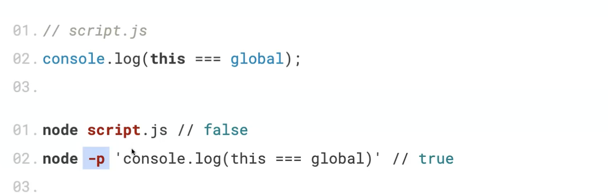

# Почему так?

В браузере this это window который является глобальным объектом. В node же, в глобальной области this - это modules.exports.  
При использовании node в режиме REPL (в режиме интерпретатора) код исполнется в глобальном контексте и как только код вводится в repl this устанавливается в global, т.е. глобальный объект.